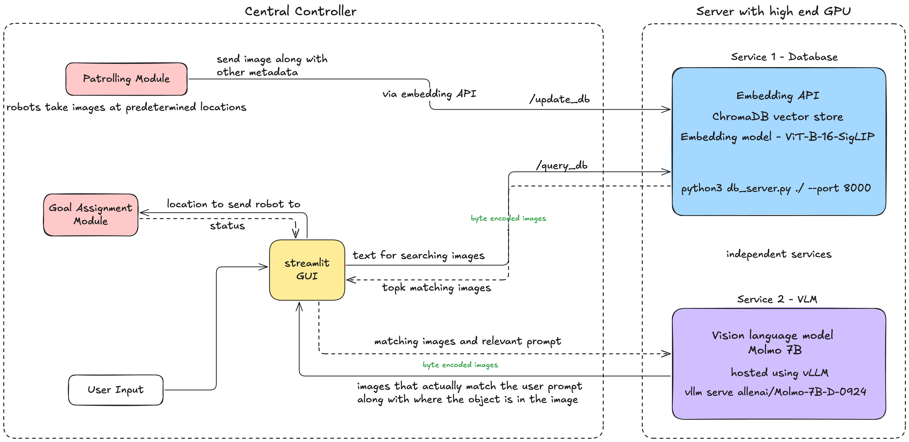

# Centralized Intelligence for Dynamic Swarm Navigation


A system to keep track of a dynamic environment using a robot swarm and search objects in it using natural language.
It can track and locate any sort of object that dynamically changes its location or appears from nowhere, sending a robot to its location.

Some features:
- no reliance on GPS or pre-built maps
- robots keep patrolling in the environment, regularly updating an internal map
- new objects and changes in positions of objects are kept up to date in a shared database
- user can query vague terms like "go upstairs" or "patient has fainted" and the relevant object will be automatically located
- can be deployed on a large no of robots and large set of end users easily
- user-friendly graphical interface

## Overview of Workflow

1. **Environment Mapping (Exploration)**  
   A swarm of robots collaboratively builds an initial map of the environment—identifying obstacles and understanding the boundaries.

2. **Continuous Monitoring (Patrolling)**  
   Robots patrol the environment, each updating the shared database with any new obstacles or changes in real time.

3. **User Queries (Task Assignment and Execution)**  
   When a user issues commands like “Go upstairs” or “Locate the nearest fire extinguisher,” the system dynamically identifies the best robot for the task and computes the shortest route. The robot then moves towards the target while avoiding dynamic obstacles as needed.


## Key Features

- **Scalability**  
  Efficiently handles large swarms with minimal delays in task assignment and path planning.

- **Robustness**  
  Adapts seamlessly to frequent and unexpected changes in the environment without needing manual intervention.

- **Modular Architecture**  
  Easily interchangeable components (e.g., different vision-language models or database backends) to accommodate various hardware setups.


## Method

1. **Vector Similarity Search**  
   - [ChromaDB](https://docs.trychroma.com/guides/multimodal) vector database  
   - Uses OpenCLIP for creating multimodal embeddings  
   - Performs vector similarity search with the HNSW algorithm, which scales logarithmically while maintaining strong accuracy

2. **Molmo Vision-Language Model (VLM)**  
   - A vision-language model trained for pointing tasks with excellent generalization out of the box  
   - Utilizes an OpenAI-compatible API and can be swapped with any other multimodal LLM API (e.g., GPT-4o)

3. **Flexible and Scalable Deployment**  
   - The database (custom-built service) and VLM inference server (vLLM) can both run on a dedicated server  
   - Each service can handle multiple concurrent requests, significantly improving scalability

4. **Task Assignment Flow**  
   1. An LLM (like gpt-4o) interprets the user query (e.g., “fire extinguisher”).
   2. Perform vector similarity search to find the top matching objects.  
   3. **Molmo** confirms the requested object’s presence and location.  
   4. A robot is assigned a goal based on the target location determined.



## Why This Approach?
  
- The combination of multimodal embeddings and vision-language reasoning makes sure the system is robust across diverse environments, and can generalize well to unfamiliar ones out-of-the-box (without needing retraining).

- Supports any LLM service that has openai-compatible API, gpt-4o along with Molmo can both be swapped by a common multimodal LLM API. In summary, anywhere between fully local to only API services can be used.

- VLM is only inferenced on the results filtered by the vector search, and that too only when a user gives a command. Similarly, LLM is also called on user queries only. This minimizes computational resources or API requests, thus reducing costs and latency. It also makes the system scalable to a large number of robots and users.

- The system is modular and can be easily adapted to various scenarios. ML models are either running on a GPU server or are API services, so robots can use cheap hardware and spend resources on other tasks like path planning, obstacle avoidance, and navigation.


Even though the current implementation is scalable enough for deployment on a large swarm, if computational resources (high-end GPU or a cloud-based GPU) are a bottleneck, the following modifications are recommended:

* Collect images from robot swarm feed while they explore the environment and label them using the vision-language model.
* Train a smaller transformer based model (like TinyViT) with the collected data. This model along with an attention map based implementation can then be swapped in place of the current Molmo model.
* Instead of using OpenCLIP, train a smaller model for creating the embeddings (based on collected data or use distillation).
* Because of modular approach it is easy to swap in a different model in our pipeline, with minimal changes in the code.
* However, accuracy of such approaches will depend a lot on the quality of the data collected.

## Example Demonstrations

https://github.com/user-attachments/assets/f962681a-cd70-48a6-a722-d7447a98157f

https://github.com/user-attachments/assets/f49c5ef4-6c81-4422-8d9c-1f71275d3801

## Prerequisites

- Tested for ROS2 Humble on Ubuntu 22.04
- Python 3.10+
- GPU with minimum 16 GB GPU memory (NVIDIA recommended)


## Setup

### Environment Variables

Create a `.env` file in the root directory of this project to store configuration variables. Make sure **not** to commit this file to version control. Populate the `.env` with the following:

```env
DB_URL=http://<db_server_ip>:8000
VLLM_URL=http://<vllm_server_ip>:8080
DATA_DIR=/path/to/local/data
OPENAI_API_KEY=your_openai_api_key
```

- `DB_URL` - URL where the Chromadb embedding API is hosted.  
- `VLLM_URL` - URL where the vLLM server is hosted.  
- `DATA_DIR` - Directory path on the local machine where data will be stored.  
- `OPENAI_API_KEY` - Your OpenAI API key for accessing language models.


## Running the Services (on the Remote Server)

Use separate terminal sessions (or a process manager such as `tmux`, `screen`, or `docker-compose`) to manage each service.

### Chromadb Vector Database Embedding API

The embedding API is a custom-built FastAPI service that calculates and stores image embeddings, offering an API to query images based on these embeddings.

**Start the Embedding API Server:**

```bash
cd /path/to/remote/data
# copy db_server.py to this directory if not done earler
python db_server.py ./ --port 8000
```

- `/path/to/remote/data` is where Chromadb will store its data on the remote server.

### vLLM Vision Language Model Server

The vLLM server hosts the Vision-Language Model responsible for interpreting and generating responses based on visual input.

**Start the vLLM Server:**

```bash
vllm serve allenai/Molmo-7B-D-0924 --task generate --trust-remote-code --max-model-len 4096 --dtype bfloat16 --port 8080
```

> **Note**  
> - `allenai/Molmo-7B-D-0924` specifies the vision-language model to use.  
> - Ensure the server has at least 16 GB of GPU memory.  
> - Adjust the `--port` if needed to avoid conflicts.

### Streamlit Application

The Streamlit app provides an interactive frontend for users to ask query and give target to the robot swarm.

**Start the Streamlit App:**

```bash
streamlit run app.py
```

> **Note**  
> - By default, Streamlit runs on `http://localhost:8501`.  
> - Use the `--server.port` flag to change the port if necessary.  
> - The app communicates with both the Chromadb embedding API and the vLLM server using the URLs in the `.env` file.
